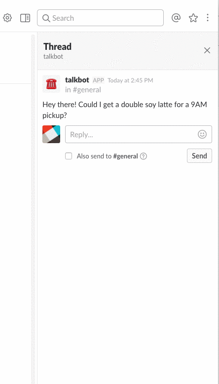

# TalkBot: Using Threads to Build a Twilio-powered Slack Bot

This tutorial walks through building Talkbot 🤖, an example application written in Node that allows you to direct incoming Twilio SMS messages to a Slack channel. We'll use the Slack Events and Web API, plug into Twilio and Firebase, utilize Slack threads, and listen/respond to message reactions.

Let's get started! 🎉👩‍💻

### This tutorial will cover:
* Setting up a Slack application and bot user, then installing it onto your team
* Using Twilio to send and receive SMS from your Slack app
* Integrating Firebase and threads to organize conversations across SMS and Slack
* Listening for and responding to Slack events

### Technologies we'll be using:
* [Slack Developer Kit for Node.js](https://github.com/slackapi/node-slack-sdk)
* [Slack Events API Module](https://github.com/slackapi/node-slack-events-api)
* [Twilio](https://www.twilio.com/docs) - *Cloud communications platform*
* [Firebase](https://firebase.google.com) - *Database solution*
* [Ngrok](https://api.slack.com/tutorials/tunneling-with-ngrok) - *Secure tunneling*
* Body Parser - *Node.js body parsing middleware*
* Express - *Web framework for Node*

## Getting Started

This tutorial is split up into 6 different sections. If you get stuck on any section at any time, you can look at the code in this repository to help you out. We've also included some resources and helpful links below for further reading.

* **Section 00: Overview and Introduction** 👈
* [Section 01: Setting up your Slack Bot](docs/section-01.md)
* [Section 02: Integrating your Bot with Twilio](docs/section-02.md)
* [Section 03: Adding Threads to Your Conversations](docs/section-03.md)
* [Section 04: Responding to Message Events](docs/section-04.md)
* [Section 05: Responding to SMS via Slack](docs/section-05.md)
* [Section 06: Adding OAuth Configuration](docs/section-06.md)

## Getting Help

If you're having trouble getting through the tutorial, or a section of the tutorial, make sure to glance through the [Slack API documentation](https://api.slack.com). The Slack Developer community is also a great resource to plug into. If you can't find anything by Googling or looking on [Stack Overflow](https://stackoverflow.com/questions/tagged/slack-api), try asking the [Dev4Slack](http://dev4slack.xoxco.com) Slack team. 