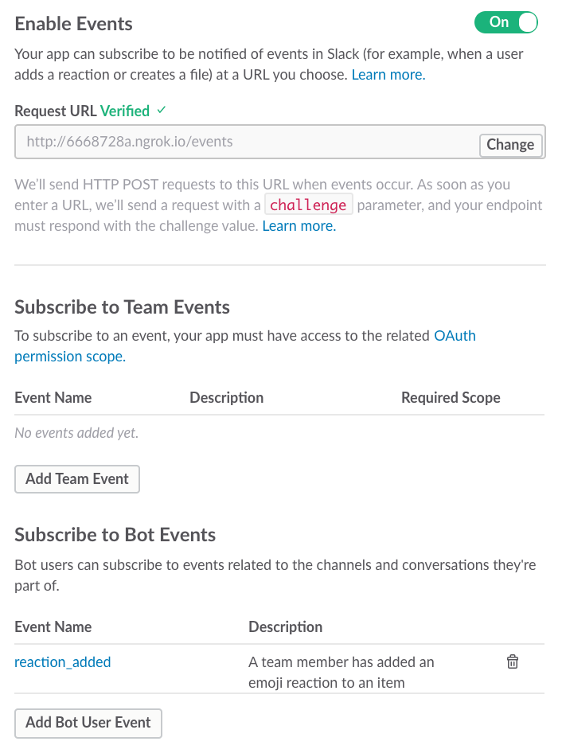

# Section 04: Responding to Message Events

* [Section 00: Overview and Introduction](../README.md)
* [Section 01: Setting up your Slack Bot](section-01.md)
* [Section 02: Integrating your Bot with Twilio](section-02.md) 
* [Section 03: Adding Threads to Your Conversations](section-03.md)
* **Section 04: Responding to Message Events** 👈
* [Section 05: Responding to SMS via Slack](section-05.md)
* [Section 06: Adding Onboarding and Message Menus](section-06.md)

In [Section 03](section-03.md), we added threading capabilities to our application, which allowed us to organize conversations in a more intuitive, non-intrusive way. Now, we're going to add the ability to mark users as *complete* so if they message us again, their message will be sent as a new message instead of in an old thread.

We'll accomplish this by using the Events API to listen for message reactions. When someone reacts to a message with ✅, we'll delete that user from the database.

## Subscribing to Reaction Events
The first thing we'll have to do is subscribe to reaction events. This is really easy with the Slack Events API. Earlier, we included the Events API Module, so we'll use that to easily acess event subscriptions. Below your initialization of your Express app, add the following snippet:

```js
// Slack events client
app.use('/events', slackEvents.expressMiddleware());
```

> 💡 *This is going to use the Slack Events API module to parse your `/events` endpoint (which is where we'll send the events). After this initial set up, it becomes easy to add single event handlers.*

Save and start your node program.

```sh
$ node index.js
```

Now go to [Your Slack Apps](https://api.slack.com/apps). Click on your app, then on the left sidebar, go to `Event Subscriptions` (under Features).

We're going to enable events, and enter the request URL we just set up. Remember to include the URL to your Ngrok server before `/events` (in my case, the full URL is `http://6668728a.ngrok.io/events`). Once we enter the url, it'll send the [URL Verification event](https://api.slack.com/events/url_verification) to our route (which the Events API module handles).



> 💡 *You can learn more about the URL verification and why it's necessary in the [Events API documentation](https://api.slack.com/events-api).*

Now we can use the Events API! 👏

## Deleting User on Reaction Event
Now that we have an event listener set up, we'll use our Events API module to react to events.

Let's set up a method to listen for a `reaction_added` event:

```js
slackEvents.on('reaction_added', (event) => {
	// Do something when a reaction is added to a message
});
```

Now, we're going to check if the reaction is a ✅ emoji. Emojis have a label that you can view in your team settings page that we can use to listen to a specific emoji (*in this case* ✅*, or `white_check_mark`*).

If it is the ✅ emoji, we're going to lookup the phone number associated with the given message ID. The message ID is passed to us in the request body (as the parameter `event.item.ts`). Once we find the user associated with the message with reaction, we'll delete that user from our database using our `deleteUser()` method.

```js
slackEvents.on('reaction_added', (event) => {
	// Check for white check mark emoji
	if (event.reaction == 'white_check_mark') {
		getNum(event.item.ts)
			.then((num) => {deleteUser(num)})
			.catch(console.error);
	}
});
```

## Messaging using Twilio from Slack
Our app is almost done. It receives messages via Twilio, and organizes those messages using threads. When we're done with a user, we can mark it as done using a ✅ reaction. One feature we're missing is responding to users that message our Slack. We'll configure responding with SMS via Slack in [Section 05](section-05.md).

* [Section 00: Overview and Introduction](../README.md)
* [Section 01: Setting up your Slack Bot](section-01.md)
* [Section 02: Integrating your Bot with Twilio](section-02.md) 
* [Section 03: Adding Threads to Your Conversations](section-03.md)
* **Section 04: Responding to Message Events** 👈
* [Section 05: Responding to SMS via Slack](section-05.md)
* [Section 06: Adding Onboarding and Message Menus](section-06.md)